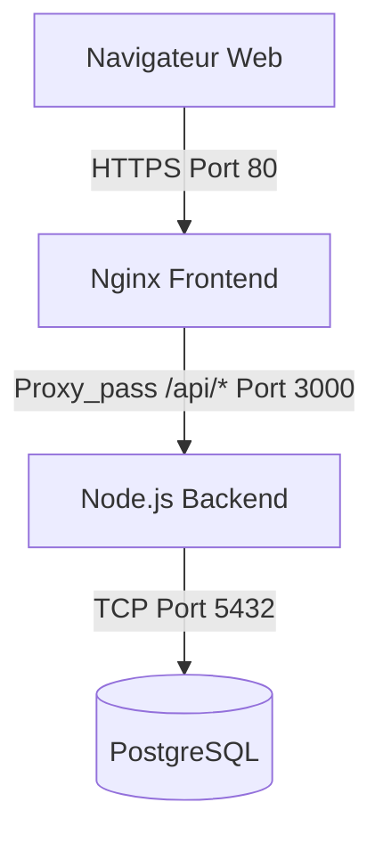

# VitalSync - L'application de Suivi Médical & Sportif

VitalSync est une application minimaliste comprenant une architecture full-stack (Back-end Node.js / Front-end Nginx / BDD PostgreSQL). Ce projet est conçu pour illustrer l'automatisation d'une chaîne CI/CD complète ainsi que son hébergement (Docker & Kubernetes).

## 🏗️ Architecture du projet
- **Front-end :** Nginx servant une application web statique (`index.html`).
- **Back-end :** Express via Node.js gérant la logique métier (`server.js`).
- **Base de données :** PostgreSQL stockant les événements médicaux (Isolation par réseau).



## 🛠️ Prérequis
Afin de pouvoir faire fonctionner l'environnement en local, il est nécessaire d'avoir installé sur votre machine :
- **Git** : Pour recréer le dépôt (version 2.x+)
- **Docker Engine** & **Docker Compose** : Pour exécuter l'infrastructure isolément (version 20.10.x+)
- *(Optionnel pour Dev)* Node.js version 20 (le projet s'exécute déjà via Compose)

## 🚀 Démarrage de l'Application (Docker Compose)
1. **Préparation des variables sensibles**
   Créer un fichier local `.env` depuis le patron fourni afin de paramétrer les identifiants de la BDD :
   ```bash
   cp .env.example .env
   # Modifier le fichier avec vos véritables identifiants (POSTGRES_USER, POSTGRES_PASSWORD)
   ```

2. **Démarrer les conteneurs (Build + Exécution)**
   Lancer et détacher les services en mode verbeux (background):
   ```bash
   docker-compose up --build -d
   ```

3. **Accéder à l'application**
   Rendez-vous à l'URL locale suivante dans votre navigateur favori : `http://localhost:80`
   Et sur l'API : `http://localhost:3000/health`

## ⚙️ Fonctionnement et Flux CI/CD
Cette solution a été automatisée au moyen des Actions GitHub (`.github/workflows/ci-cd.yml`). L'image livrée est traitée par un multi-stage build. Le cycle de déploiement opère étape par étape :
- **Lint & Test Phase** : Vérification stricte via `ESLint` des erreurs et validation du moteur de règles unitaire `Jest`. Si les exigences d'intégration logicielle échouent à ce stade, le processus s'arrête en erreur.
- **Build Docker & Push Hub** : À la fin de chaque pull réussi sur la cible Main/Develop, GitHub crée une build épurée puis "Push" directement sur GitHub Container Registry (GHCR), permettant le versioning exact (Commit SHA).
- **Run en Staging** : Lance automatiquement les containeurs (simulé en pipeline), évalue une attente tampon de 10 secondes et procède à un audit curl de type _Liveness Probe_ (health check). Sans succès de code d'état HTTP `200`, le job CI s'arrête.

## 🧭 Choix Techniques
- **Multi-Stage Build (Node.js) & Alpine Linux** : Ces normes de conteneurisation apportent en compacité et isolation absolue des bibliothèques nécessaires à la compilation par rapport à un build volumineux et poreux en données en termes de sécurité (Développement vs. Dev-Live vs. Prod-Live).
- **Conventional Commits & Gitflow** : Permettent de catégoriser la pertinence et le traçage des ajouts d'un pool d'intégration étendu limitant substantiellement les "merge conflicts" liés à la structure des tâches.
- **GitHub Actions via Actions & Secret Keys** : Gestion des clés cryptographiques sécurisées par un tiers de confiance empêchant que des informations sensibles tombent à découvert au sein de manifestes YAML dupliqués et publiquement visibles.